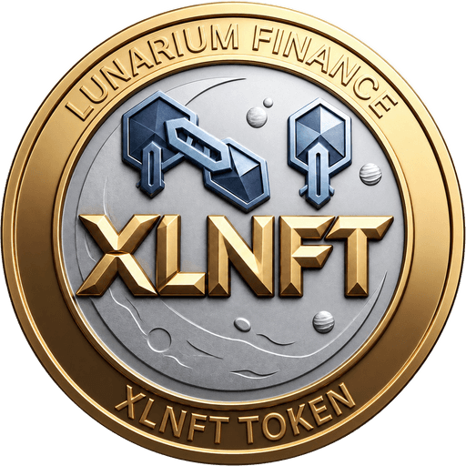

# XLNFT — Lunarium Finance (BEP-20)

**XLNFT is the BEP-20 token that bridges LunariumCoin (XLN) to Web3.**

Masternode holders will be able to swap their rewards for XLNFT on BNB Chain, and XLNFT holders will be able to acquire LunariumCoin to join the decentralized network — one loop, two chains.

> Status: building the bridge — LunariumTrade launching soon.

Website: https://lunariumcoin.com/XLNFT-Finance/

## Token information

| | |
|---|---|
| Name | Lunarium Finance (XLNFT) |
| Network | BNB Smart Chain · BEP-20 |
| Total supply | 100,000,000 XLNFT — fixed, no mint |
| Decimals | 18 |
| Contract | `0x5a6625B65a917c872ceEc781B6c4419F6aBc8A48` |
| Source code | Verified on [BscScan](https://bscscan.com/address/0x5a6625B65a917c872ceEc781B6c4419F6aBc8A48#code) |

## The XLNFT reward loop

1. **Lunarium masternode** — rewards are earned on LunariumCoin.
2. **XLNFT** — rewards are swapped into XLNFT (BEP-20) on BNB Chain.
3. **LunariumCoin** — XLNFT is used to acquire LunariumCoin, which returns to the masternode network.

The swap will run through the upcoming LunariumTrade exchange.

## Security

- Always confirm the exact contract address above before interacting with XLNFT.
- Lunarium Labs will never contact you first to request funds or private keys.

## Links

- LunariumCoin (core): https://github.com/Lunariumcoin-Labs/LunariumCoin
- Website: https://lunariumcoin.com
- Contact: lunariumcoin.xln@gmail.com

© 2026 Lunarium Labs
